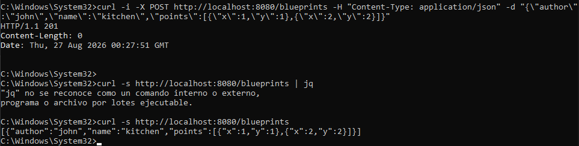
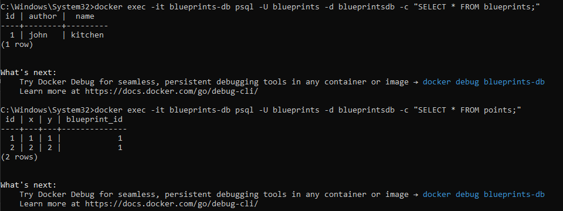
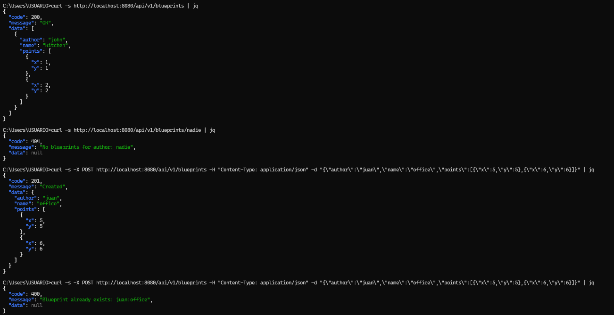

## Laboratorio #4 – REST API Blueprints (Java 21 / Spring Boot 3.3.x)
# Escuela Colombiana de Ingeniería – Arquitecturas de Software  

---

## 📋 Requisitos
- Java 21
- Maven 3.9+

## ▶️ Ejecución del proyecto
```bash
mvn clean install
mvn spring-boot:run
```
Probar con `curl`:
```bash
curl -s http://localhost:8080/blueprints | jq
curl -s http://localhost:8080/blueprints/john | jq
curl -s http://localhost:8080/blueprints/john/house | jq
curl -i -X POST http://localhost:8080/blueprints -H 'Content-Type: application/json' -d '{ "author":"john","name":"kitchen","points":[{"x":1,"y":1},{"x":2,"y":2}] }'
curl -i -X PUT  http://localhost:8080/blueprints/john/kitchen/points -H 'Content-Type: application/json' -d '{ "x":3,"y":3 }'
```

> Si deseas activar filtros de puntos (reducción de redundancia, *undersampling*, etc.), implementa nuevas clases que implementen `BlueprintsFilter` y cámbialas por `IdentityFilter` con `@Primary` o usando configuración de Spring.
---

Abrir en navegador:  
- Swagger UI: [http://localhost:8080/swagger-ui.html](http://localhost:8080/swagger-ui.html)  
- OpenAPI JSON: [http://localhost:8080/v3/api-docs](http://localhost:8080/v3/api-docs)  

---

## 🗂️ Estructura de carpetas (arquitectura)

```
src/main/java/edu/eci/arsw/blueprints
  ├── model/         # Entidades de dominio: Blueprint, Point
  ├── persistence/   # Interfaz + repositorios (InMemory, Postgres)
  │    └── impl/     # Implementaciones concretas
  ├── services/      # Lógica de negocio y orquestación
  ├── filters/       # Filtros de procesamiento (Identity, Redundancy, Undersampling)
  ├── controllers/   # REST Controllers (BlueprintsAPIController)
  └── config/        # Configuración (Swagger/OpenAPI, etc.)
```

> Esta separación sigue el patrón **capas lógicas** (modelo, persistencia, servicios, controladores), facilitando la extensión hacia nuevas tecnologías o fuentes de datos.

---

## 📖 Actividades del laboratorio

### 1. Familiarización con el código base
- Revisa el paquete `model` con las clases `Blueprint` y `Point`.  

**Point:** Tenemos una sola linea en la que se obtiene un constructor con sus getters, este nos da un punto de coordenadas del un plano
```java
  public record Point(int x, int y) { }
  ```
**Blueprint:** Este nos da un plano que esta compuesto por varios puntos con el autor, nombre y los puntos 

- Entiende la capa `persistence` con `InMemoryBlueprintPersistence`.  

Esta tiene 5 operaciones que son guardar, buscar por autor y nombre, buscar por autor, traer todos, y agregar un punto.
Tambien detecta y inyexcta automaticamente en la interfaz BlueprintPersistence. Tambien maneja exceptiones 

- Analiza la capa `services` (`BlueprintsServices`) y el controlador `BlueprintsAPIController`.

**BlueprintService:** Este actua como un intermediario entre los controladores y la base de datos, tambien aplica un filter sobre el resultado y 
expone los endpoints REST actuales bajo "/blueprints"

### 2. Migración a persistencia en PostgreSQL
- Configura una base de datos PostgreSQL (puedes usar Docker).  

Creamos un compose.yaml

Tambien agregamos unas dependencas al Pom de JPA para no escribir SQL a mano y configuramos el "application.properties" hacemos
que Hibernate cree las tablas solo, de las clases "@Entity" que se va a crear 

En persistence creamos **PointEntity** para que cada Point pertenecera a un BlueprintEntity, creamos *BlueprintEntity:** para tener la representacion en base de datos de Blueprint
y creamos **BlueprintJpaRepostitory:** que genera la implementacion y el SQL solo con los nombre de los metodos

- Implementa un nuevo repositorio `PostgresBlueprintPersistence` que reemplace la versión en memoria.  

Hace que este inyecte en vez de InMemoryBlueprintPersistence en cualquier lugar donde pida la interfaz sin tener
que tocar el Service ni el controller
 
- Probamos de esta manera
  ```bash
  # Levanta el Postgres
    docker compose up -d

    #Compilar y correr la app
    mvn clean install
    mvn spring-boot:run

    #Probar no van a la memoria 
    curl -i -X POST http://localhost:8080/blueprints -H 'Content-Type: application/json' -d '{"author":"john","name":"kitchen","points":[{"x":1,"y":1},{"x":2,"y":2}]}'

    curl -s http://localhost:8080/blueprints | jq
  ```
Tenemos que abrir otra terminal y funcionara
    
Al ejecutar SELECT * FROM blueprints, vemos que se creó correctamente el Blueprint y al 
hacer SELECT * FROM points, muestra que los dos puntos tambien se guardaron.
    


### 3. Buenas prácticas de API REST

- Cambia el path base de los controladores a `/api/v1/blueprints`.
- Usa **códigos HTTP** correctos:  
  - `200 OK` (consultas exitosas).  
  - `201 Created` (creación).  
  - `202 Accepted` (actualizaciones).  
  - `400 Bad Request` (datos inválidos).  
  - `404 Not Found` (recurso inexistente).  
- Implementa una clase genérica de respuesta uniforme:
  ```java
  public record ApiResponse<T>(int code, String message, T data) {}
  ```
  Ejemplo JSON:
  ```json
  {
    "code": 200,
    "message": "execute ok",
    "data": { "author": "john", "name": "house", "points": [...] }
  }
  ```

Primero creamos la carpeta dto en la que va a estar el ApiResponse que tendra todas las respuesta de la API ya sean de exito
o de error, para que reciba la misma forma de JSON, un ejemplo en JSON como el que nos dieron antes y con los codigos HTTP que nos dieron.

```java
  {
        "code": 200,
        "message": "execute ok",
        "data": { "author": "john", "name": "house", "points": [...] }
    }
```
Tambien creamos el **GlobalExceptionHandler** para que centralice el manejo de errores anted de que lleguen al controller
y los errores respondan con el mismo formato del ApiResponse y Bad Request.

para realizar las pruebas necesitamos JASON si no lo tienes instalalo de esta manera
```bash
  winget install jqlang.jq
```
Estos son los ejemplos
```bash
  //200 OK
  curl -s http://localhost:8080/api/v1/blueprints | jq
    
  //404 Not Found
  curl -i http://localhost:8080/api/v1/blueprints/nadie
    
  //201 Created
  curl -s -X POST http://localhost:8080/api/v1/blueprints -H "Content-Type: application/json" -d "{\"author\":\"juan\",\"name\":\"office\",\"points\":[{\"x\":5,\"y\":5},{\"x\":6,\"y\":6}]}" | jq
    
  //400 Bad Request (ya existe este autor)
curl -s -X POST http://localhost:8080/api/v1/blueprints -H "Content-Type: application/json" -d "{\"author\":\"juan\",\"name\":\"office\",\"points\":[{\"x\":5,\"y\":5},{\"x\":6,\"y\":6}]}" | jq
```
aqui lo vemos en las imagenes


### 4. OpenAPI / Swagger
- Configura `springdoc-openapi` en el proyecto.  
- Expón documentación automática en `/swagger-ui.html`.  
- Anota endpoints con `@Operation` y `@ApiResponse`.

Ya en el pom estaba la configuracion del `springdoc-openapi`, tambien con el pom se epone
la documentacion en el swagger. Cambio la clase **BlueprintsAPIController** encima de cad uno de los 
4 metodos del controlador como en elmetodo **getAll**

```java
  @Operation(
        summary = "Obtener todos los blueprints",
        description = "Retorna el conjunto completo de blueprints registrados en el sistema."
)
@ApiResponses(value = {
        @io.swagger.v3.oas.annotations.responses.ApiResponse(
                responseCode = "200",
                description = "Consulta exitosa",
                content = @Content(mediaType = MediaType.APPLICATION_JSON_VALUE,
                        schema = @Schema(implementation = ApiResponse.class)))
})
@GetMapping
public ResponseEntity<ApiResponse<Set<Blueprint>>> getAll()
```
ahora para probar el swager se ejecuta de esta manera, abriendo el http en el navegador 
```bash
  mvn spring-boot:run
  http://localhost:8080/swagger-ui.html
```

En esta imagen se puede ver como quedo el swagger


### 5. Filtros de *Blueprints*
- Implementa filtros:
  - **RedundancyFilter**: elimina puntos duplicados consecutivos.  
  - **UndersamplingFilter**: conserva 1 de cada 2 puntos.  
- Activa los filtros mediante perfiles de Spring (`redundancy`, `undersampling`).  

Tenemos el **RedundancyFilter:** que elimina puntos duplicados consecutivos y este recorre la lista de puntos 
comparando cada punto con el anterior.
**UndersamplingFilter:** conserva 1 de cada 2 puntos reduciendo la densidad del trazo a la mitad.
ya que si tiene 2 puntos o menos, no aplica el filtro, porque no tendria sentido reducirlo mas 

se puede probar con 
```bash
  #no filtra
  mvn spring-boot:run
  #RedundancyFilter
  mvn spring-boot:run -Dspring-boot.run.profiles=redundancy
  #UndersamplingFilter
  mvn spring-boot:run -Dspring-boot.run.profiles=undersampling
```

---

## ✅ Entregables

1. Repositorio en GitHub con:  
   - Código fuente actualizado.  
   - Configuración PostgreSQL (`application.yml` o script SQL).  
   - Swagger/OpenAPI habilitado.  
   - Clase `ApiResponse<T>` implementada.  

2. Documentación:  
   - Informe de laboratorio con instrucciones claras.  
   - Evidencia de consultas en Swagger UI y evidencia de mensajes en la base de datos.  
   - Breve explicación de buenas prácticas aplicadas.  

---

## 📊 Criterios de evaluación

| Criterio | Peso |
|----------|------|
| Diseño de API (versionamiento, DTOs, ApiResponse) | 25% |
| Migración a PostgreSQL (repositorio y persistencia correcta) | 25% |
| Uso correcto de códigos HTTP y control de errores | 20% |
| Documentación con OpenAPI/Swagger + README | 15% |
| Pruebas básicas (unitarias o de integración) | 15% |

**Bonus**:  

- Imagen de contenedor (`spring-boot:build-image`).  
- Métricas con Actuator.  